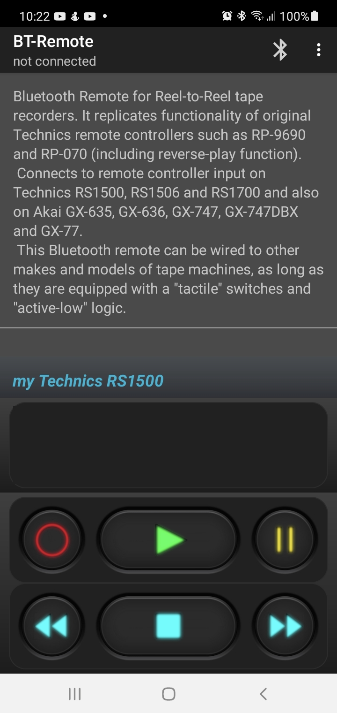
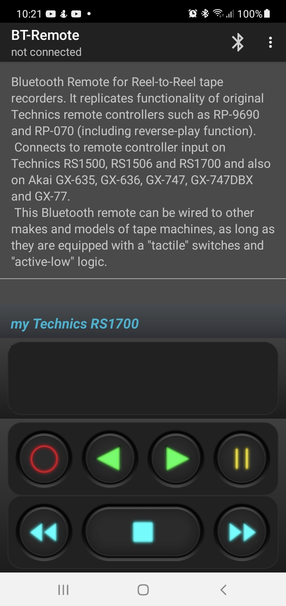
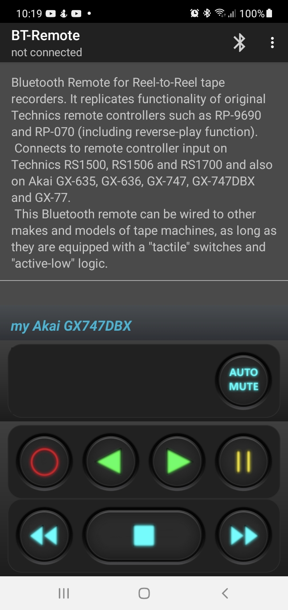
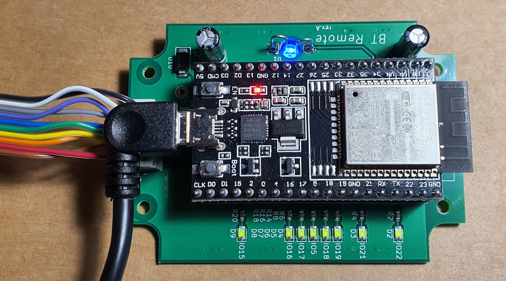
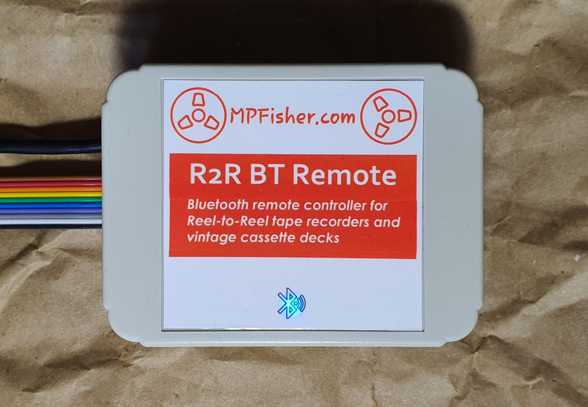
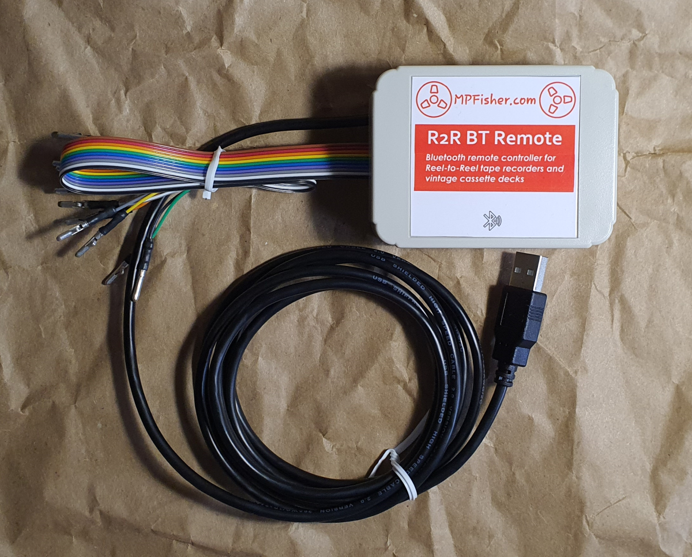
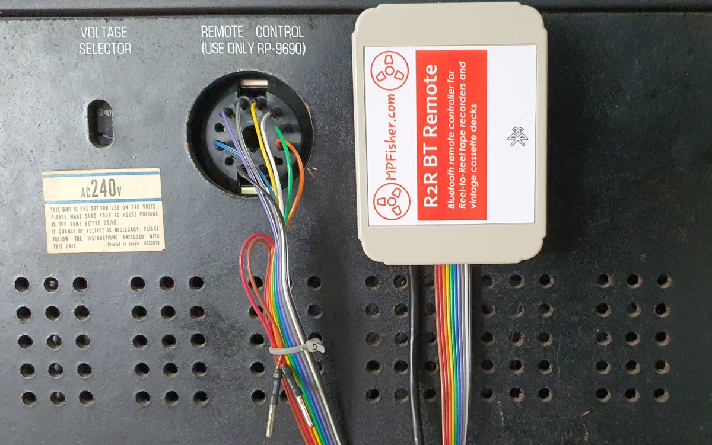

<h1> Bluetooth Remote Controller</h1>

For Reel-to-Reel tape recorders and vintage cassette decks.

Works with any open-reel (reel-to-reel) tape deck equipped with remote control connector, with active-low inputs

It replicates functionality of original Technics remote controllers such as RP-9690 and RP-070 (including reverse-play function). 
Connects to remote controller input on Technics RS1500, RS1506 and RS1700 and also on Akai GX-635, GX-636, GX-747, GX-747DBX, GX-77 and also vintage cassette decks. 
This Bluetooth remote can be wired to other makes and models of tape machines, as long as they are equipped with a "tactile" tape transport buttons and "active-low" logic, such as Pioneer RT909.

Screenshots: 
 

 I have some of the receivers fully built, if you don't want to build one yourself. 
Please <a href="mailto:audio@mpfisher.com">contact me</a> for details. 

Software is provided "as is" without any guarantee. I am looking for a colaborators who would want to develop it further and also help develop iOS app for iPhone/iPad.

To-Do:
